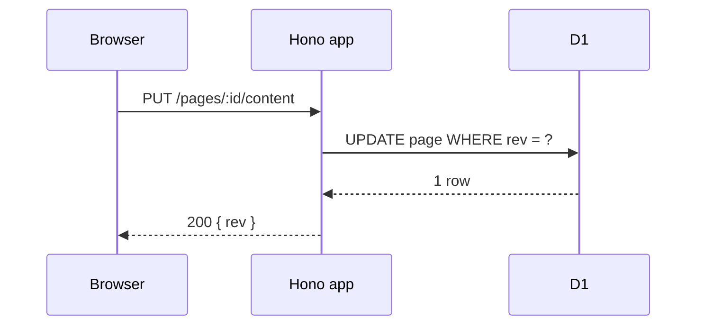

Here's the request flow as a diagram:

```mermaid
sequenceDiagram
    participant B as Browser
    participant A as Hono app
    participant D as D1
    B->>A: PUT /pages/:id/content
    A->>D: UPDATE page WHERE rev = ?
    D-->>A: 1 row
    A-->>B: 200 { rev }
```

The `rev` check makes the save **atomic** without transactions.
